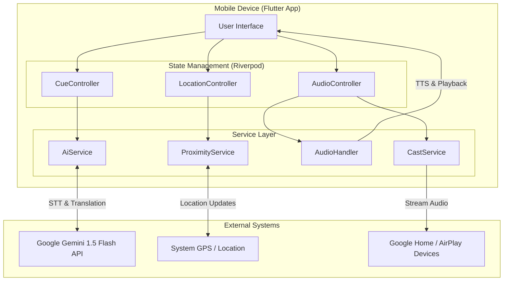

# HearHere Technical Architecture

```mermaid
graph TD
    subgraph "Mobile Device (Flutter App)"
        UI[User Interface]
        
        subgraph "State Management (Riverpod)"
            CueController
            LocationController
            AudioController
        end
        
        UI --> CueController
        UI --> LocationController
        UI --> AudioController

        subgraph "Service Layer"
            AiService
            ProximityService
            AudioHandler
            CastService
        end

        CueController --> AiService
        LocationController --> ProximityService
        AudioController --> AudioHandler
        AudioController --> CastService
        
    end

    subgraph "External Systems"
        Gemini[Google Gemini 1.5 Flash API]
        GPS[System GPS / Location]
        CastReceivers[Google Home / AirPlay Devices]
    end

    AiService <-->|STT & Translation| Gemini
    ProximityService <-->|Location Updates| GPS
    CastService -->|Stream Audio| CastReceivers
    AudioHandler -->|TTS & Playback| UI
```
