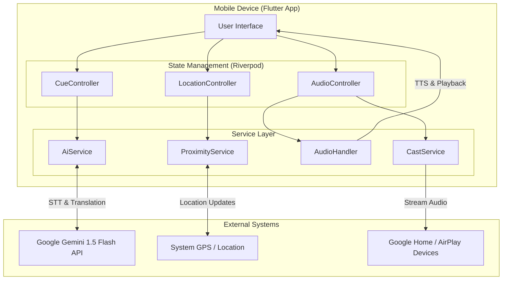

# HearHere: AI-Powered Location Accessibility & Community Engagement
**Candidate for the 2026 Presidential AI Challenge**
**Category:** Track II (Technical/Implementation)
**Submission Date:** January 7, 2026

## Project Summary

In an increasingly digital world, the physical environment remains a challenge for many to navigate and understand fully. For individuals with visual impairments, identifying landmarks, reading signs, or understanding the context of a location can be difficult or impossible without assistance. Furthermore, language barriers often prevent members of our diverse communities from fully engaging with local history, warnings, or public information. **HearHere** is a mobile application designed to bridge this gap by anchoring digital information to physical locations, powered by artificial intelligence to make that information accessible, translatable, and interactable for everyone.

HearHere allows users to create and discover "Cues"—location-based audio markers that trigger automatically when a user is in proximity. Unlike traditional GPS audio guides, HearHere leverages advanced AI to enhance the creation and consumption of this content. By integrating **Google's Gemini 1.5 Flash** model, HearHere offers real-time translation and speech-to-text capabilities, ensuring that community knowledge is not bound by language or the ability to type.

The application addresses the community challenge of **Accessibility and Inclusive Information Access**. It serves two primary user groups: those who need auditory assistance to understand their surroundings (such as the visually impaired) and those who wish to share or learn about their community (educators, historians, municipal organizers).

Our solution creates a layer of "invisible accessibility" over the physical world. A visually impaired user walking through a park or city center can receive audible descriptions of statues, building entrances, or safety hazards automatically. A tourist or non-native speaker can hear these same descriptions translated instantly into their native language. By democratizing the creation of these cues through voice commands (Speech-to-Text), we empower the community to build its own accessibility network.

This project represents a tangible implementation of AI for social good. Rather than replacing human interaction, HearHere augments our relationship with the places we live, making them safer, more informative, and more welcoming to all.

---

## 1. The Community Challenge

**Problem Statement:**
Our communities are filled with visual information—signs, historical plaques, warning labels, and navigational aids—that is inaccessible to millions of people.
1.  **Visual Impairment:** The World Health Organization estimates that globally, at least 2.2 billion people have a near or distance vision impairment. For these individuals, independent navigation and environmental awareness are constant challenges.
2.  **Language Barriers:** In diverse nations like the United States, non-English speakers often struggle to access local community information, leading to isolation or missed opportunities for engagement.
3.  **Static Information:** Physical signs are static and expensive to update. They cannot adapt to the user's needs, language, or changing conditions.

**Target Impact:**
The goal of HearHere is to remove these barriers by creating a dynamic, auditory interface for the physical world that adapts to the user.

## 2. The Solution: HearHere

HearHere is a cross-platform mobile application (iOS and Android) built with **Flutter**. It utilizes the device's GPS and background location services to monitor the user's position relative to "Cues."

**Key Features:**
*   **Proximity-Based Playback:** Audio content plays automatically when a user enters a defined radius of a Cue, allowing for a hands-free experience essential for safety and accessibility.
*   **Universal Creation:** Users can place Cues anywhere. This crowdsourced approach allows for a rapid expansion of accessible spots, from a "Step careful" warning on a broken sidewalk to a historical fact about a local library.
*   **Casting Support:** Integration with Google Cast and AirPlay allows the audio content to be shared on external speakers, useful for group tours or classroom settings.

## 3. AI Implementation

The core innovation of HearHere lies in its integration of Artificial Intelligence to enhance content accessibility. We utilize **Google's Gemini 1.5 Flash**, a state-of-the-art multimodal generative AI model, to power key features.

### A. Intelligent Speech-to-Text (STT)
Creating content on mobile devices can be cumbersome, especially for those with motor or visual impairments. HearHere implements an AI-powered STT workflow:
*   **Implementation:** Users can record their voice directly in the app. The audio data is processed by Gemini 1.5 Flash to generate an accurate text transcription.
*   **Benefit:** This allows users to create Cues simply by speaking, making the *creation* of accessibility tools accessible itself.

### B. Generative Translation
To address language barriers, HearHere employs generative AI for context-aware translation.
*   **Implementation:** When a user encounters a Cue in a foreign language, the app uses Gemini 1.5 Flash to translate the text content into the user's preferred language. The system understands context better than traditional literal translators, preserving the nuance of historical or safety-critical information.
*   **Benefit:** A single English Cue placed by a town official can be audible in Spanish, Mandarin, or French for residents and visitors, instantly multiplying the value of the information.

### C. Text-to-Speech (TTS)
For Cues that are text-based (or translated text), HearHere utilizes advanced on-device Text-to-Speech engines (`flutter_tts`). This ensures that even if a Cue is entered as text, it is consumed as audio, maintaining the "eyes-free" promise of the application.

## 4. Technical Architecture

*   **Frontend:** Flutter (Dart) for high-performance, native-like experiences on iOS and Android.
*   **State Management:** Riverpod for robust and testable application state handling.
*   **AI Service:** A dedicated `AiService` layer abstracts the interaction with the Gemini API, ensuring modularity and easy upgrades to future models.
*   **Background Services:** `ProximityService` runs efficiently in the background to detect locations without draining the battery excessively, ensuring the app is always "listening" for locations even when the phone is in a pocket.

### Architecture Diagram

## 5. Future Roadmap

We view the current version of HearHere as a foundational step. Our roadmap for the next 12 months includes:
*   **Computer Vision Integration:** Allowing users to take a photo of a landmark and having the AI automatically generate a description and create a Cue.
*   **Personalized Tours:** Using AI to curate a sequence of Cues based on a user's interests (e.g., "Show me 19th-century architecture nearby").
*   **Hazard Detection:** Aggregating data from Cues to identify clusters of safety warnings for municipal review.

## 6. Conclusion

HearHere is more than just a navigation app; it is a **digital layer of empathy** for our physical spaces. By leveraging the power of the 2026 Presidential AI Challenge's focus on community solutions, we aim to demonstrate that AI can be a personal, helpful assistant that reconnects us with our neighborhoods and with each other.

By submitting to Track II, we present a working, scalable solution that addresses the immediate needs of accessibility and inclusion in American communities.
