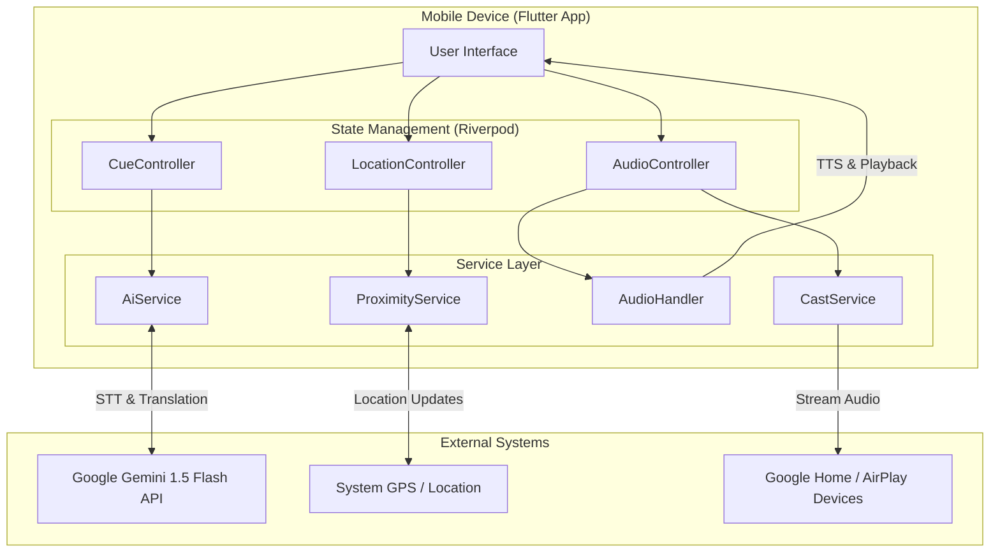

# Presentation Script & Video Plan: HearHere

**Target Duration:** ~4 Minutes
**Theme:** Modern, Clean, "Tech for Good".
**Audio Style:** Warm, clear, verified narration. Soft, inspiring background music that swells at the end.

---

## Slide 1: Title Slide

**Visual Description:**
*   **Slide:** Clean title card with the "HearHere" logo (or stylized text) in the center. Subtitle: "AI-Powered Location Accessibility".
*   **Video Action:** Fade in from black. The logo pulses gently. A map of a local community fades in the background with "pins" popping up one by one.

**Text on Slide:**
*   **Title:** HearHere
*   **Subtitle:** AI-Powered Location Accessibility & Community Engagement
*   **Team:** Randall Zhang, Runxin Tao, Jefferson Liu, Xiyao Sha
*   **Coach:** Yuecheng Zhang
*   **Category:** 2026 Presidential AI Challenge - Track II

**Spoken Script (0:00 - 0:25):**
"In a world that is increasingly connected effectively, we often forget that our physical environment remains a disconnect for many. Welcome to HearHere: a project dedicated to bridging the gap between digital information and physical space. I am presenting on behalf of our team of 10th graders from Pennsylvania and Florida: Randall, Runxin, Jefferson, and Xiyao, guided by our coach Yuecheng Zhang. We are proud to submit HearHere to Track Two of the 2026 Presidential AI Challenge."

---

## Slide 2: The Challenge

**Visual Description:**
*   **Slide:** Split interface. Left: A photo of a busy street crossing. Right: A photo of a historical sign in a foreign language.
*   **Video Action:**
    *   Show stock footage of a visually impaired person using a cane, pausing comfortably at a corner.
    *   Cut to a tourist looking confused at a map or sign.
    *   Overlay text statistics appearing in sync with the narration.

**Text on Slide:**
*   **The Invisible Barriers:**
    *   **Visual Impairment:** 2.2+ Billion globally.
    *   **Language Barriers:** Missed connections in diverse communities.
    *   **Static Info:** Signs don't speak, update, or adapt.

**Spoken Script (0:25 - 1:00):**
"Our communities are filled with critical information—warning signs, historical plaques, and navigational aids. But for millions, this information is invisible. Globally, over two-point-two billion people live with a vision impairment, making a simple walk down the street a challenge. Furthermore, in our diverse society, language barriers often prevent residents and visitors from understanding local history or safety warnings. Physical signs are static; they cannot talk, they cannot translate themselves, and they are expensive to update. We asked ourselves: How can we make the physical world speak to everyone?"

---

## Slide 3: The Solution - HearHere

**Visual Description:**
*   **Slide:** High-quality mock-up of the app. A "Cue" card appears on screen with a waveform.
*   **Video Action:**
    *   Screen recording of the app: Map view showing the user walking.
    *   As the user icon enters a circle (geofence), a generic notification pops up and audio begins to play (visualized by a waveform).

**Text on Slide:**
*   **Anchoring Digital Knowledge to Physical Spaces**
*   **"Cues":** Location-based audio markers.
*   **Hands-Free:** Automatic proximity playback.
*   **Inclusive:** Making the invisible, audible.

**Spoken Script (1:00 - 1:40):**
"Our answer is HearHere. HearHere is a mobile application that anchors digital information to physical locations. We call these anchors 'Cues'. Unlike traditional GPS guides, HearHere is designed for 'invisible accessibility'. The app monitors your location in the background. When you walk within range of a Cue—whether it’s a warning about a broken sidewalk or a story about a local landmark—the audio plays automatically. It’s a hands-free experience, which is critical for safety and for those using assistance devices. We aren't just putting dots on a map; we are creating a digital layer of empathy over our neighborhoods."

---

## Slide 4: AI Power - Gemini 1.5 Flash

**Visual Description:**
*   **Slide:** A diagram showing the flow: Microphone Icon -> Gemini Logo -> Text Doc / Translation Icon.
*   **Video Action:**
    *   Zoom in on the **Google Gemini 1.5 Flash** logo.
    *   Animation: A voice wave turns into text, then the text morphs into a different language (e.g., English to Spanish).

**Text on Slide:**
*   **Powered by Google Gemini 1.5 Flash**
*   **Intelligent Speech-to-Text:** Create by speaking.
*   **Generative Translation:** Context-aware, instant translation.

**Spoken Script (1:40 - 2:20):**
"What truly sets HearHere apart is its integration of Google’s Gemini 1.5 Flash. We use this advanced multimodal AI to solve two massive problems: creation and consumption. First, typing on a phone while walking is difficult and unsafe. With HearHere, you simply speak to create a Cue. Gemini’s intelligent Speech-to-Text transcribes your voice instantly, cleaning up the grammar so you don't have to. Second, we break down language walls. If a Cue is recorded in English, but the user speaks Spanish or Mandarin, Gemini performs a generative, context-aware translation in real-time. It doesn't just swap words; it preserves the nuance and meaning, ensuring safety and understanding."

---

## Slide 5: Key Features

**Visual Description:**
*   **Slide:** Three distinct columns/icons: Proximity (Radar), Universal Access (Globe/Crowd), Sharing (Cast Icon).
*   **Video Action:**
    *   Rapid montage: 
        1.  Phone in a pocket (audio playing).
        2.  A user speaking into the phone to make a cue.
        3.  A teacher casting the audio to a classroom speaker.

**Text on Slide:**
*   **Features:**
    *   **Proximity-Based Playback:** Eyes-free navigation.
    *   **Crowdsourced Creation:** Anyone can contribute.
    *   **Casting Support:** AirPlay & Google Cast for groups.

**Spoken Script (2:20 - 3:00):**
"Let’s look at the core features. First is **Proximity-Based Playback**. The app is always listening for location, even when your phone is in your pocket, allowing you to focus on your surroundings, not your screen. Second is **Universal Creation**. We are crowdsourcing accessibility. A town official can mark a hazard, or a student can tag a historical site—building a rich database of community knowledge. Finally, we built in **Casting Support**. Whether it’s Google Cast or AirPlay, tours can immediately be shared on external speakers, making HearHere a powerful tool for educators and group leaders."

---

## Slide 6: Technical Architecture

**Visual Description:**
*   **Slide:** Logos for Flutter, Dart, Riverpod, and Gemini. A simple block diagram of the app structure.
*   **Video Action:**
    *   Scroll through a snippet of the code (e.g., `AiService` or `ProximityService`).
    *   Highlight the "Flutter" and "Gemini" logos.

**Text on Slide:**
*   **Under the Hood:**
    *   **Frontend:** Flutter (iOS & Android)
    *   **State:** Riverpod
    *   **AI:** Gemini 1.5 Flash API
    *   **Background:** Efficient `ProximityService`

**Diagram:**

**Spoken Script (3:00 - 3:30):**
"Technically, HearHere is built for performance and scale. We utilized **Flutter** to deploy a single, native-performance codebase to both iOS and Android. Our state is managed robustly with **Riverpod**, ensuring a glitch-free experience. The heart of our intelligence, the `AiService`, connects directly to the Gemini API, allowing for modular upgrades. And crucially, our custom `ProximityService` runs efficiently in the background, minimizing battery usage while maintaining high GPS accuracy."

---

## Slide 7: Future Roadmap

**Visual Description:**
*   **Slide:** A winding road graphic with three stops: "Now", "Next Year", "Future".
*   **Video Action:**
    *   Icon for a camera scanning a building (Computer Vision).
    *   Icon for a personalized tour route.

**Text on Slide:**
*   **Roadmap:**
    *   **Computer Vision:** "Snap to Ask" for visual identification.
    *   **Personalized Tours:** AI-curated routes based on interests.
    *   **Hazard Detection:** Aggregating Cues for city safety.

**Spoken Script (3:30 - 3:50):**
"We are just getting started. Our roadmap for the next twelve months includes integrating Computer Vision, allowing users to simply take a photo of a landmark to generate a Cue. We also plan to implement AI-curated tours, where the app guides you based on your specific interests, like 'architecture' or 'history', and hazard detection to help municipalities identify unsafe areas."

---

## Slide 8: Conclusion

**Visual Description:**
*   **Slide:** The team photo or a collage of the team working. Text: "HearHere".
*   **Video Action:**
    *   Show the team discussing code or testing the app outdoors.
    *   Fade to black with the project website or repo link.

**Text on Slide:**
*   **A Digital Layer of Empathy**
*   **Thank You!**
*   **HearHere**

**Spoken Script (3:50 - 4:15):**
"HearHere is more than just a navigation app; it is a digital layer of empathy for our physical spaces. By leveraging the power of Gemini 1.5 Flash, we are proving that AI can be a personal, helpful assistant that reconnects us with our neighborhoods and with each other. Thank you for your time and consideration."

---
**Total Estimated Word Count:** ~580 words.
**Total Estimated Time:** 4:00 - 4:15 minutes (at normal speaking pace).
